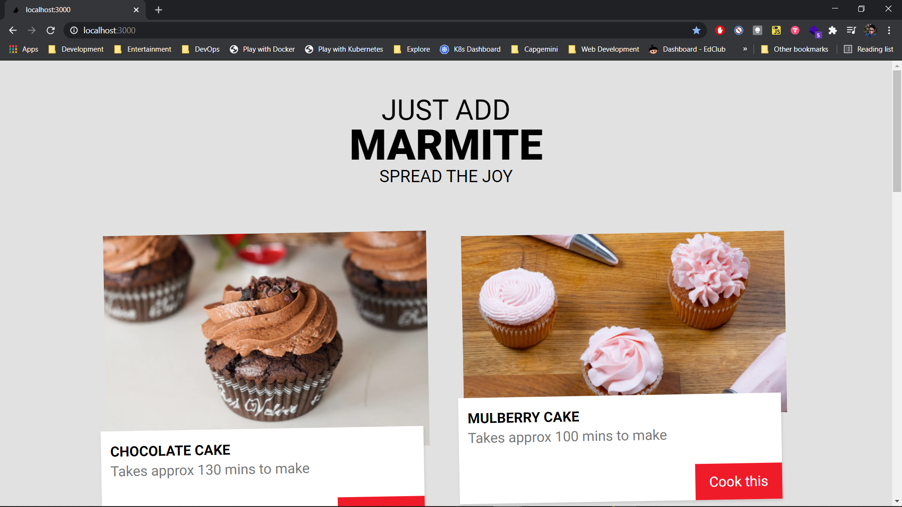
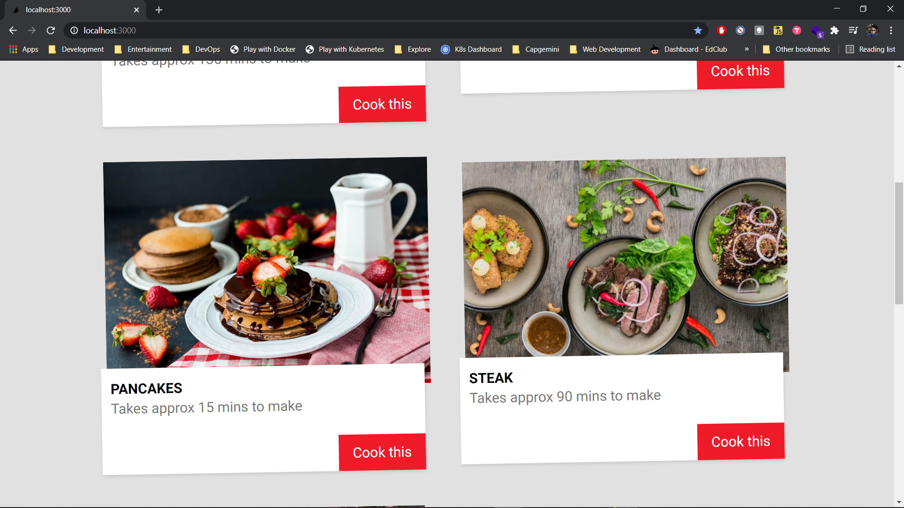
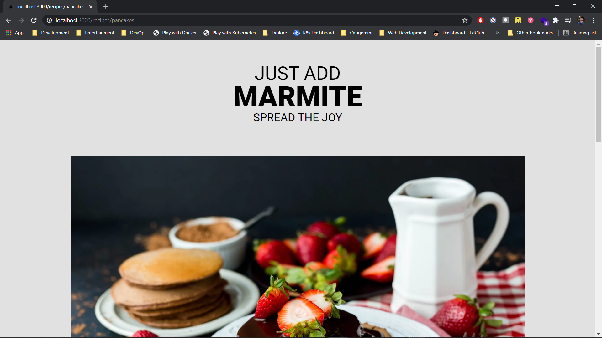
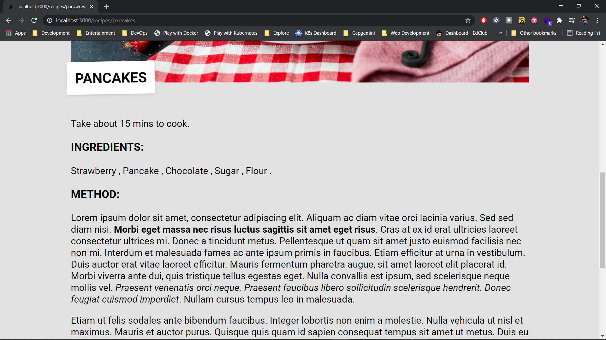
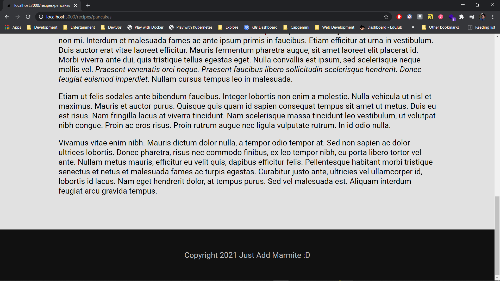

# NextJS Recipe Book

- [NextJS Recipe Book](#nextjs-recipe-book)
  - [Deployment](#deployment)
  - [Description](#description)
  - [Screenshots](#screenshots)

## Deployment

- Checkout deployment at <https://nextjs-recipe-book-gagandeep39.vercel.app/>

## Description

- Recipe Book app created using Serverside rendering framework Next JS
- Backend consists of Contentful CMS
- Applicaiton deployed on Vercel
- Reference <https://www.youtube.com/watch?v=m9mNsYJbkNg&list=PL4cUxeGkcC9jClk8wl1yJcN3Zlrr8YSA1&index=1/>

## Screenshots

